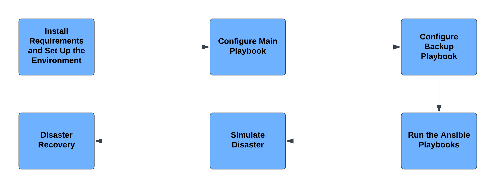

 

Let's learn how to use the Configuration Management tool Ansible & how it can be used for Disaster Recovery!

Configuration Management tools are crucial for DevOps environments since they make the environments configurable via scripts. Furthermore, Configuration Management helps prevent unauthorized changes, minimizes the risk of errors, and ensures a stable and secure system. It is thus useful in systems that require high safety, such as military systems, which will be the theme of this tutorial.

In this tutorial you will learn how to use the Configuration Management tool Ansible, which is a tool that enables automation of the configuration and management of a system. You will set up a server which will represent a simple missile system. Additionally, you will learn how Configuration Management tools could be worthwhile setting up since they facilitate Disaster Recovery in case something unexpected happens… 

