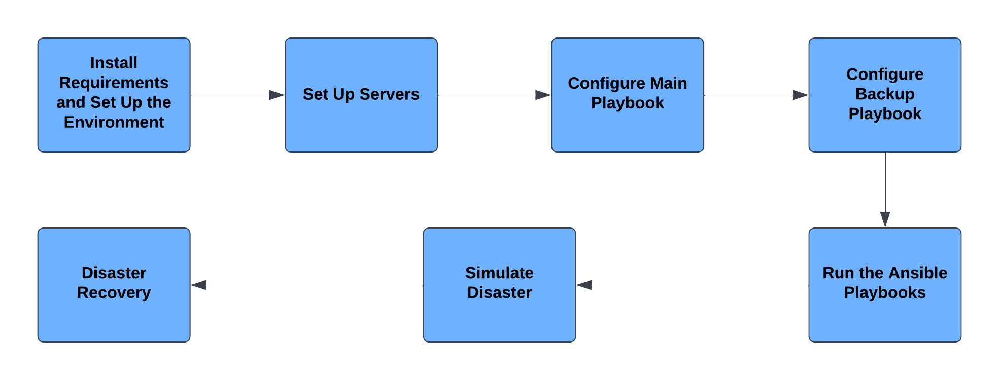

 

Let's learn how to use the Configuration Management tool Ansible & how it can be used for Disaster Recovery!

Configuration Management tools are crucial for DevOps environments since they make the environments configurable via scripts. Furthermore, Configuration Management helps prevent unauthorized changes, minimizes the risk of errors, and ensures a stable and secure system. It is thus useful in systems that require high safety, such as military systems, which will be the theme of this tutorial.

In this tutorial you will learn how to use the Configuration Management tool Ansible, which is a tool that enables automation of the configuration and management of a system. Additionally, you will learn how Configuration Management tools could be worthwhile setting up since they facilitate Disaster Recovery in case something unexpected happens…

Firstly, you will install Ansible and set up the local environment, which will represent the missile system. You will then also configure two servers within Docker containers: a primary command server and a backup server, ensuring system resilience. The command server will handle essential commands such as launching and aborting missiles, while the backup server will take over if any issues arise with the main server. Then you will configure the system using Ansible. Finally, a disaster will be simulated, which you will solve using Disaster Recovery. Here’s a flowchart of this tutorial:

